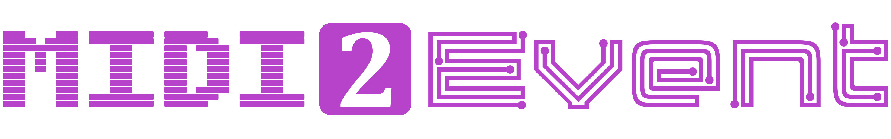

<a id="readme-top"></a>

<br />
<div align="center">
  <a href="https://github.com/cadenceblorbo/midi2event">
    
  </a>

<h3 align="center">MIDI2Event</h3>

  <p align="center">A lightweight C# library for synchronizing audio and code events in an artist-driven context.</p>
  <p align="center"><a href="https://github.com/cadenceblorbo/midi2event/issues">Report Bug/Request Feature</a></p>
</div>

<details>
  <summary>Table of Contents</summary>
  <ol>
    <li><a href="#about-the-project">About The Project</a></li>
    <li><a href="#getting-started">Getting Started</a></li>
    <li>
      <a href="#usage">Usage</a>
      <ul>
        <li><a href="#unity-pointers">Unity Pointers</a></li>
      </ul>
      <ul>
        <li><a href="#godot-pointers">Godot Pointers</a></li>
      </ul>
    </li>
    <li><a href="#current-limitations">Current Limitations</a></li>
    <li><a href="#roadmap">Roadmap</a></li>
    <li><a href="#license">License</a></li>
    <li><a href="#contact">Contact</a></li>
    <li><a href="#Acknowledgments">Acknowledgments</a></li>
  </ol>
</details>


## About The Project

MIDI2Event allows users to synchronize code events to music by encoding event charts using MIDI data. Notes in the MIDI chart can be linked to events, triggering them in time with the sepereate audio file. You can think of the MIDI data as operating similar to an [Audio-Animatronic](https://en.wikipedia.org/wiki/Audio-Animatronics), where the MIDI notes in the chart are not used to generate audio, but rather to generate behavior. This eliminates the need for creating custom charting software, and enables charts to be created by artists and developers in whatever DAW they already use (as the MIDI file format is widely supported). 

This library was primarily created for the sake of game developers, but could be applied to other fields.

<p align="right">(<a href="#readme-top">back to top</a>)</p>


## Getting Started

Download the latest source code .zip or .dll and place it in your project. Import the MIDI2Event namespace at the top of your script with a `using` statement:
```csharp
using MIDI2Event;
```

<p align="right">(<a href="#readme-top">back to top</a>)</p>


## Usage

First, create a MIDI2EventSystem using its constructor, passing in the path to your MIDI chart (and an optional lowest octave if your DAW doesn't use -1 as its lowest):
```csharp
MIDI2EventSystem(string filePath, int lowestOctave = -1)
```
<br/>

To subscribe events to this system, use the `MIDI2EventSystem.Subscribe()` method:
```csharp
public Action Subscribe(
    Action action,
    Notes note = 0,
    int octave = 0,
    SubType type = SubType.NoteStart
)
```
This method allows you to specify what event you want an `Action` to be triggered by. Currently, you can trigger an action using:
* `SubType.NoteStart`
* `SubType.NoteStop`
* `SubType.ChartEnd`

If you are using a note-based event, you can specify which note and octave to assign the `Action` to.
<br/>
<br/>

Call `MIDI2EventSystem.Update()` in whatever update function your engine/tool has, passing in the deltaTime in seconds (preferably calculated from the samples of the playing audio).
<br/>
<br/>

You can control the playback of the event system using `Play()`, `Pause()`, `Stop()`, and `Reset()`.
<br/>
<br/>

**Currently, the user is responsible for implementing control over the actual audio that plays, as that is dependant on the engine/tool you are using. There are plans to make premade packages for Godot and Unity in the future.**
<br/>
<br/>

### Unity Pointers

* MIDI charts must be stored in a [StreamingAssets](https://docs.unity3d.com/Manual/StreamingAssets.html) folder to be accessible in the build.
* In my experience, the best [import settings](https://docs.unity3d.com/Manual/class-AudioClip.html) to use for associated audio clips is to disable Load In Background, use the Decompress On Load load type, and disable Preload Audio Data.
  * This will require you to manually load the audio before using it with [`AudioClip.LoadAudioData()`](https://docs.unity3d.com/6000.0/Documentation/ScriptReference/AudioClip.LoadAudioData.html).
* For the best synchronization, it is reccomended to calculate the deltaTime passed into MIDI2Event using [`AudioSource.timeSamples`](https://docs.unity3d.com/6000.0/Documentation/ScriptReference/AudioSource-timeSamples.html).

### Godot Pointers

Coming Soon (?)

<p align="right">(<a href="#readme-top">back to top</a>)</p>


## Current Limitations
As this library was developed for personal use at first, it currently has limitations on the kind of MIDI data that can be used:
* MIDI data must use format 0 (consisting of a single MIDI track).
* Delta-time must be encoded using ticks per quarter note.

([This page](http://www.music.mcgill.ca/~ich/classes/mumt306/StandardMIDIfileformat.html) has more details on the MIDI file format.)

<p align="right">(<a href="#readme-top">back to top</a>)</p>


## Roadmap

- [x] Basic Features
- [ ] Expanded MIDI Support
    - [ ] More Formats
    - [ ] More Chunks
- [ ] Premade Engine Packages
    - [ ] Unity
    - [ ] Godot
- [ ] Formal Documentation

<p align="right">(<a href="#readme-top">back to top</a>)</p>


## License

Distributed under the GNU Lesser General Public License, Version 3. See `LICENSE.txt` for more information.

<p align="right">(<a href="#readme-top">back to top</a>)</p>


## Contact

Cadence Hagenauer - [devilstritone#0000](https://discord.com/users/302985879666950144) - cadence.hagenauer@gmail.com

Project Link: [https://github.com/cadenceblorbo/midi2event](https://github.com/cadenceblorbo/midi2event)

<p align="right">(<a href="#readme-top">back to top</a>)</p>


## Acknowledgments

* [Estrogen Font by Apostrophic Laboratory](https://luc.devroye.org/fonts-24297.html)
* [Membra Font by Disaster Fonts](http://disasterfonts.co.uk/)

<p align="right">(<a href="#readme-top">back to top</a>)</p>

